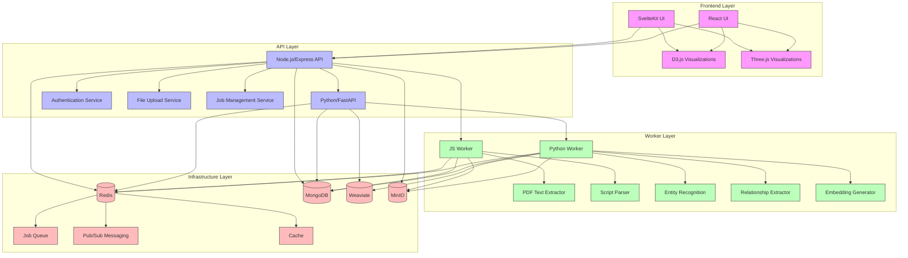
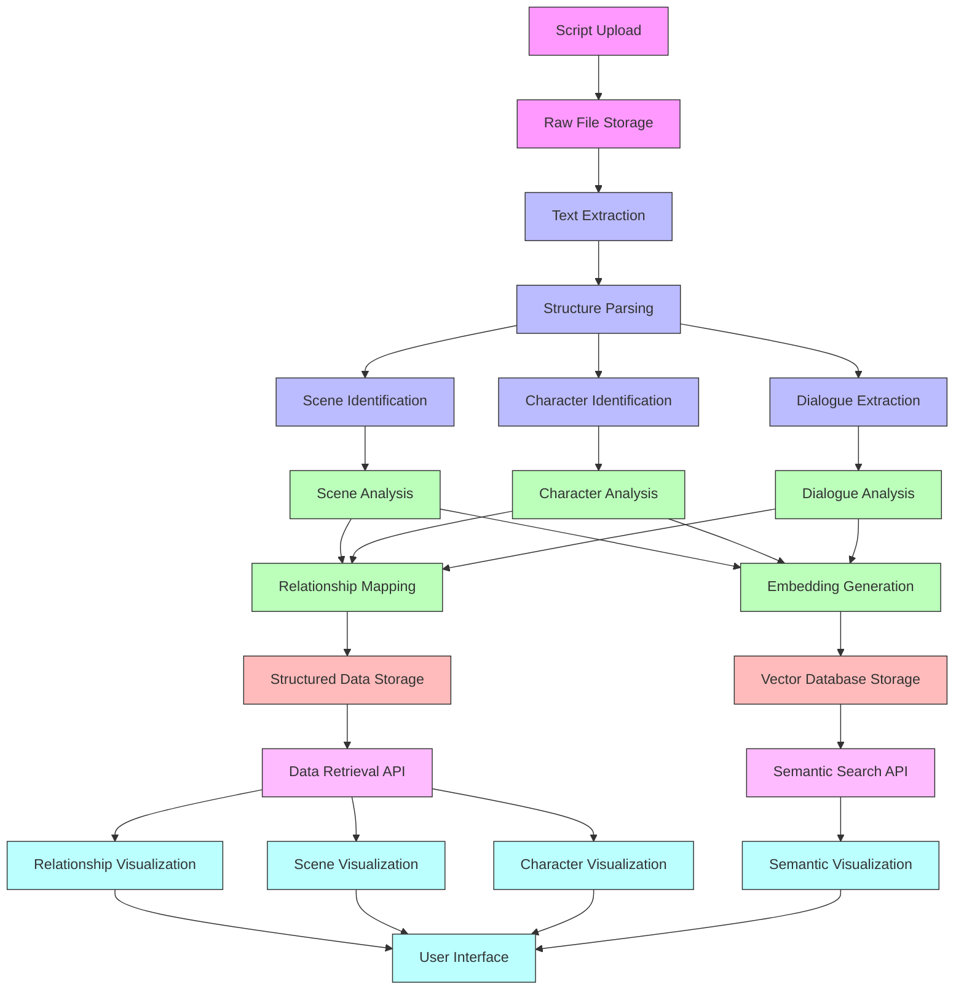
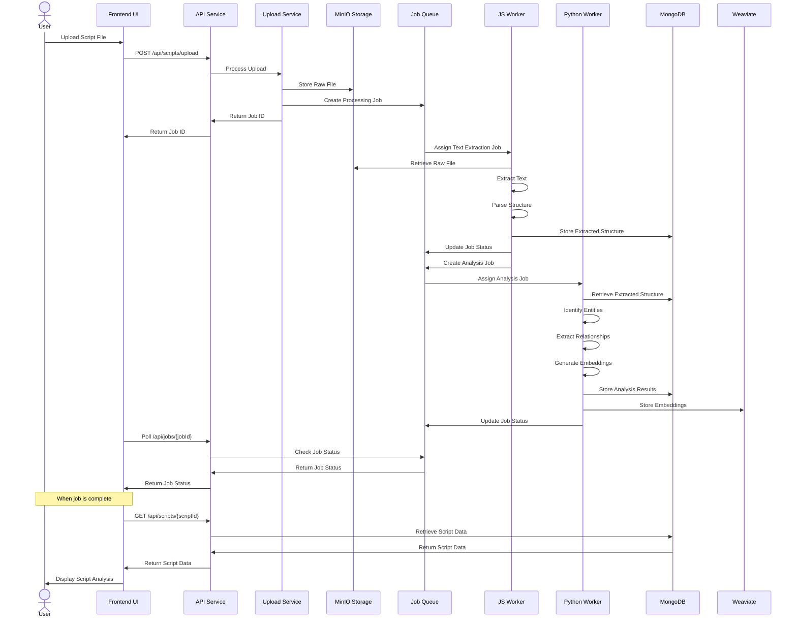
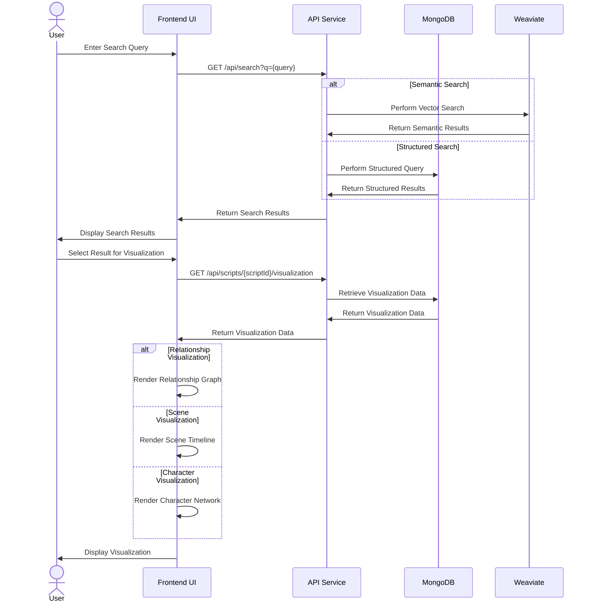
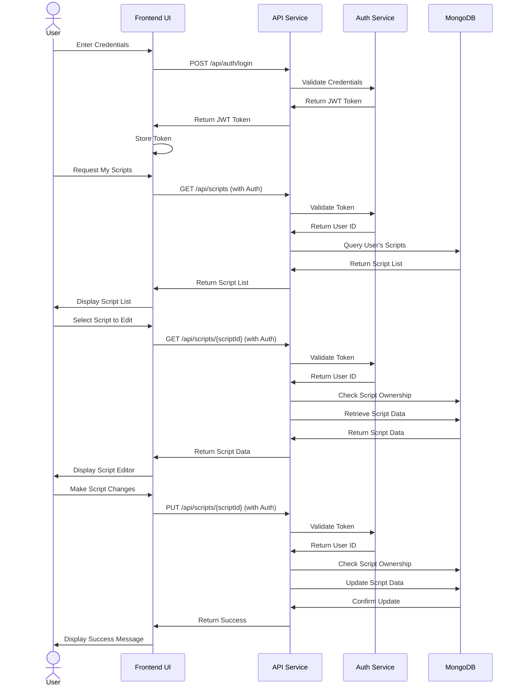
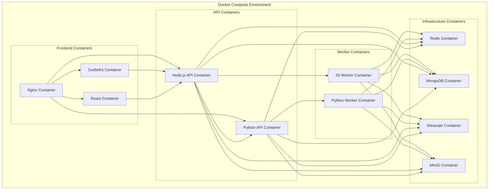
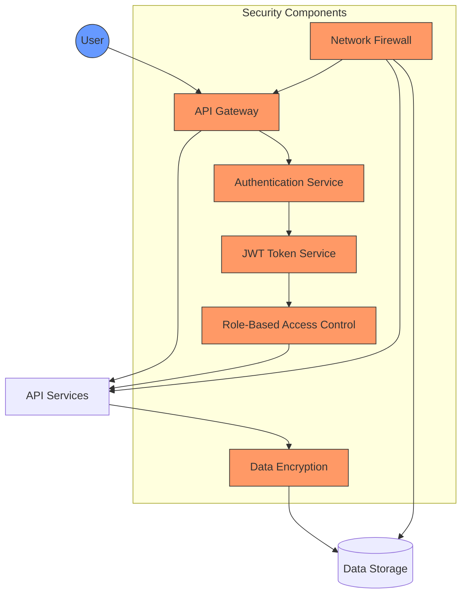

# Site2Data Architecture Documentation

This document provides a detailed overview of the Site2Data system architecture, including component diagrams, data flow diagrams, and sequence diagrams for key workflows.

## Architecture Diagram (Detailed)

The following diagram illustrates the detailed architecture of the Site2Data system, showing all components and their interactions:

## Data Flow Diagram (Processing Pipeline)

The following diagram illustrates the data flow through the Site2Data processing pipeline, from script upload to visualization:

## Sequence Diagrams for Key Workflows

### 1. Script Upload and Processing Workflow

### 2. Search and Visualization Workflow

### 3. User Authentication and Script Management Workflow

## Component Responsibilities

### Frontend Layer

| Component | Responsibility |
|-----------|----------------|
| SvelteKit UI | Primary user interface for script upload, management, and visualization |
| React UI | Secondary interface for specialized visualization features |
| D3.js Visualizations | Data-driven visualizations for relationships and structures |
| Three.js Visualizations | 3D visualizations for complex script elements |

### API Layer

| Component | Responsibility |
|-----------|----------------|
| Node.js/Express API | Main API service handling client requests |
| Python/FastAPI | Specialized API for ML-specific operations |
| Authentication Service | User authentication and authorization |
| File Upload Service | Handling file uploads and validation |
| Job Management Service | Managing and tracking processing jobs |

### Worker Layer

| Component | Responsibility |
|-----------|----------------|
| JS Worker | Processing jobs for text extraction and basic analysis |
| Python Worker | Advanced ML processing and analysis |
| PDF Text Extractor | Extracting text from PDF files |
| Script Parser | Parsing script structure and elements |
| Entity Recognition | Identifying entities in script text |
| Relationship Extractor | Determining relationships between entities |
| Embedding Generator | Creating vector embeddings for semantic analysis |

### Infrastructure Layer

| Component | Responsibility |
|-----------|----------------|
| Redis | Caching, pub/sub messaging, and job queues |
| MongoDB | Primary document storage |
| Weaviate | Vector database for semantic search |
| MinIO | Object storage for raw files |
| Job Queue | Managing processing jobs |
| Pub/Sub Messaging | Communication between components |
| Cache | Caching frequently accessed data |

## Technology Stack Details

| Layer | Technologies | Description |
|-------|--------------|-------------|
| Frontend | SvelteKit, React, D3.js, Three.js | Modern web frameworks for responsive UI and data visualization |
| API | Node.js, Express, FastAPI, JWT | REST APIs for client communication with authentication |
| Workers | Node.js, Python, spaCy, Hugging Face Transformers | Processing engines for text analysis and ML tasks |
| Infrastructure | Redis, MongoDB, Weaviate, MinIO | Data storage and messaging services |

## Communication Protocols

| Protocol | Usage | Components |
|----------|-------|------------|
| REST API | Client-server communication | Frontend ↔ API |
| WebSockets | Real-time updates | Frontend ↔ API |
| Redis Pub/Sub | Inter-service messaging | API ↔ Workers |
| MongoDB Queries | Data retrieval and storage | API ↔ MongoDB, Workers ↔ MongoDB |
| Vector Queries | Semantic search | API ↔ Weaviate, Workers ↔ Weaviate |
| S3 Protocol | File storage and retrieval | API ↔ MinIO, Workers ↔ MinIO |

## Deployment Architecture

The system is designed for containerized deployment using Docker and Docker Compose:

## Security Architecture

## Scalability Considerations

- **Horizontal Scaling**: Worker components can be scaled horizontally to handle increased processing load
- **Load Balancing**: API services are designed to work behind load balancers
- **Database Sharding**: MongoDB can be sharded for improved performance with large datasets
- **Caching Strategy**: Redis caching is used for frequently accessed data
- **Stateless Design**: API services are stateless to facilitate scaling
- **Resource Isolation**: Each component runs in its own container with dedicated resources

## Monitoring and Logging

- **Centralized Logging**: All components send logs to a centralized logging service
- **Performance Metrics**: Key performance indicators are tracked for each component
- **Health Checks**: Regular health checks ensure system stability
- **Alerting**: Automated alerts for system issues
- **Tracing**: Distributed tracing for request flows across components

## Disaster Recovery

- **Data Backups**: Regular backups of all databases
- **Redundancy**: Critical components have redundant instances
- **Failover**: Automatic failover for infrastructure components
- **Recovery Procedures**: Documented procedures for system recovery
- **Data Integrity**: Checksums and validation to ensure data integrity
