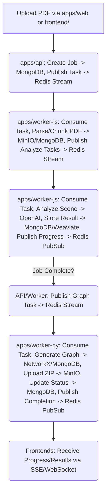

# Ideal vs. Current AI/ML-Driven Screenplay Parser – Architecture & Features

*This document outlines the target features of an advanced parser and compares them with the current implementation based on the `ReverseEngineering` analysis.*

## 1. Input & Preprocessing
- **Supported formats (Current):** PDF (via `apps/worker-js` using libraries like `pdf-parse`). TXT might be implicitly supported if the upload mechanism allows it.
- **Supported formats (Ideal):** PDF, TXT, Fountain, Final Draft, DOCX.
- **Batch processing (Current):** Likely single file processing per job initiated by frontend upload.
- **Batch processing (Ideal):** Capability to process multiple files or directories.
- **Text normalization (Current):** Basic text extraction from PDF. Advanced normalization (OCR artifact removal, encoding fixes) not explicitly confirmed.
- **Text normalization (Ideal):** Robust normalization for various input quality levels.

## 2. Scene Segmentation (Current - `apps/worker-js`)
- **Method:** Likely a combination of Regex (e.g., `INT./EXT.`) and potentially LangChain's `RecursiveCharacterTextSplitter`.
- **Output:** Chunks of text, potentially aligned with scene boundaries, passed to subsequent analysis steps.
- **Scene object:** Internal representation within the worker, likely containing raw text and identifiers.

## 3. Scene Analysis Pipeline (Current - `apps/worker-js` & `apps/worker-py`)
For each scene/chunk:
- **Core Analysis (Current - `apps/worker-js` via OpenAI):**
  - Model: OpenAI API (e.g., `gpt-4o-mini`).
  - Prompting: Uses prompts from `packages/prompts/` (e.g., `scene_v1.txt`) to extract structured JSON data (characters, location, summary, etc.).
  - Validation: Uses AJV for validating the JSON schema of the LLM response.
  - Retry: Basic retry logic might exist, potentially using a `fix_json.txt` prompt for repair.
- **Embeddings (Current - `apps/worker-js`):**
  - Model: OpenAI Embeddings.
  - Storage: Weaviate Vector Store (purpose likely for future semantic search).
- **Graph Generation (Current - `apps/worker-py`):**
  - Input: Analyzed scene data from MongoDB.
  - Model/Library: NetworkX (Python).
  - Output: Graph structure (nodes, edges), exported as GEXF within a ZIP file.
- **Advanced Analysis (Ideal / Partially Current):**
  - **NER (Named Entity Recognition):** *Partially covered by OpenAI analysis.* Ideal: dedicated NER models (e.g., Transformers) for higher precision on specific entities (props, specific locations, etc.).
  - **Sentiment & Mood Analysis:** *Partially covered by OpenAI analysis.* Ideal: Dedicated classifiers fine-tuned for film domain.
  - **Action/Pattern Classification:** *Likely basic coverage by OpenAI summary.* Ideal: Dedicated classifiers.
  - **Character & Relationship Extraction:** *Core part of OpenAI analysis.* Ideal: More nuanced analysis (sentiment, strength, evolution).
  - **Location, Costume, Equipment Suggestions:** *Ideal features, likely require specific LLM prompting, not confirmed currently.*

## 4. Output Structure (Current)
- **Per Job:**
  - Metadata in MongoDB (status, progress, PDF source, result ZIP URL).
  - Analyzed scene data (structured JSON) in MongoDB.
  - Text embeddings in Weaviate.
  - Result ZIP file in MinIO containing GEXF graph and potentially raw analysis JSON.
- **Global (Ideal):**
  - Aggregated lists (props, costumes, etc.) across the entire script.
  - Comprehensive character bible.
  - Scene-by-scene breakdown formatted for production.

## 5. Technology Stack (Current - see `readme.md` or `ReverseEngineering/07_ArchitectureOverview.md`)
- **Orchestration:** Node.js (`apps/api`, `apps/worker-js`), Python (`apps/worker-py`).
- **AI/ML:** OpenAI API (generation, embeddings), NetworkX (graph).
- **Libraries:** Express, tRPC, React, MUI, Zustand, Axios, ReactFlow/Sigma, pdf-parse, AJV, Pino, LXML.
- **Infrastructure:** MongoDB, Redis (Streams, Pub/Sub), MinIO, Weaviate, Docker.
- **Monorepo:** pnpm, Turbo.

## 6. Hardware/Software Requirements (Current - For Running via Docker Compose)
- **Docker & Docker Compose:** Required.
- **RAM:** Sufficient RAM for all containers (Node, Python, Redis, Mongo, Weaviate, MinIO, Frontends) - likely 8GB+, 16GB+ recommended.
- **CPU:** Modern multi-core CPU.
- **Disk:** Space for Docker images, source code, MinIO storage, DB data.
- **Node.js/pnpm:** For local development outside Docker.
- **Internet:** Required for OpenAI API calls, dependency downloads.

## 7. Example Pipeline (Current - High Level)

## 8. Next Steps (Focus Areas)
- **Stabilize & Test:** Ensure reliability of the current pipeline, add comprehensive tests.
- **Enhance Analysis:** Improve depth and accuracy of OpenAI prompts or integrate specialized models (NER, Sentiment) if needed.
- **Develop Frontend:** Fully implement graph visualization and results display in `frontend/`.
- **Improve UX:** Refine progress reporting, error handling, and user feedback.
- **Documentation:** Consolidate and complete technical documentation.

---
**This document contrasts the ideal vision with the current implementation, highlighting achieved features and areas for future development.**