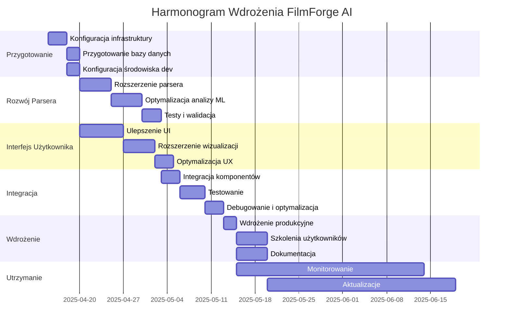

# Plan Wdrożenia i Rozwoju FilmForge AI

## Spis treści
- [Opis Aplikacji](#opis-aplikacji)
- [Architektura Aplikacji](#architektura-aplikacji)
- [Technologie](#technologie)
- [Funkcjonalności](#funkcjonalności)
- [Plan Wdrożenia](#plan-wdrożenia)
- [Harmonogram Wdrożenia](#harmonogram-wdrożenia)
- [Zasoby Niezbędne do Wdrożenia](#zasoby-niezbędne-do-wdrożenia)
- [Potencjalne Ryzyka i Strategie Mitygacji](#potencjalne-ryzyka-i-strategie-mitygacji)
- [Strategia Testowania](#strategia-testowania)
- [Procedury Migracji Danych](#procedury-migracji-danych)
- [Plan Szkoleń dla Użytkowników](#plan-szkoleń-dla-użytkowników)
- [Rekomendacje Dotyczące Monitorowania i Utrzymania](#rekomendacje-dotyczące-monitorowania-i-utrzymania)
- [Szczegółowy Plan Poprawy Aplikacji](#szczegółowy-plan-poprawy-aplikacji)
- [Strategia Testowania i Zapewnienia Jakości](#strategia-testowania-i-zapewnienia-jakości)

## Opis Aplikacji

FilmForge AI to kompleksowa platforma do analizy scenariuszy filmowych z wykorzystaniem sztucznej inteligencji. Aplikacja umożliwia parsowanie scenariuszy w formacie PDF, wyodrębnianie struktury (sceny, dialogi, postacie), przeprowadzanie analizy emocjonalnej tekstu, wykrywanie relacji między postaciami oraz wizualizację danych w eleganckim interfejsie użytkownika.

## Architektura Aplikacji

Aplikacja składa się z kilku głównych komponentów:

1. **Rdzeń Site2Data** - ogólny framework do ekstrakcji danych z różnych źródeł:
   - Moduł ekstrakcji danych z plików PDF
   - Moduł ekstrakcji danych ze stron internetowych

2. **FilmForge AI (Site2Data Film)** - specjalizowana aplikacja do analizy scenariuszy filmowych:
   - Parser scenariuszy (script_parser_updated.js)
   - Analizator ML (ml_analyzer.js)
   - API do zaawansowanej analizy (advanced_analysis_routes.js)

3. **Interfejs użytkownika**:
   - Aplikacja webowa (HTML, CSS, JavaScript)
   - Interaktywne wykresy i wizualizacje

4. **Backend**:
   - Serwer Express.js
   - Obsługa przesyłania i analizy plików
   - API do komunikacji z frontendem

## Technologie

Aplikacja wykorzystuje następujące technologie:

- **Backend**: Node.js, Express.js
- **Baza danych**: MongoDB (choć obecnie używany jest prosty system plików JSON)
- **Analiza tekstu**: natural, compromise, node-nlp
- **Parsowanie PDF**: pdf-parse
- **Frontend**: HTML5, CSS3, JavaScript, Chart.js
- **Web scraping**: axios, cheerio, puppeteer (dla site2data-general)

## Funkcjonalności

1. **Parsowanie scenariuszy**:
   - Obsługa różnych formatów scenariuszy
   - Wyodrębnianie scen, postaci, dialogów, lokacji
   - Identyfikacja rekwizytów i specjalnych wymagań

2. **Analiza emocjonalna**:
   - Analiza sentymentu tekstu
   - Wykrywanie emocji w scenach
   - Śledzenie łuku emocjonalnego całego scenariusza

3. **Analiza relacji między postaciami**:
   - Wykrywanie interakcji między postaciami
   - Klasyfikacja typów relacji
   - Wizualizacja sieci relacji

4. **Analiza strukturalna**:
   - Identyfikacja punktów zwrotnych
   - Analiza tempa narracji
   - Wykrywanie głównych tematów i motywów

5. **Wizualizacja danych**:
   - Interaktywne wykresy emocji
   - Przegląd statystyk scenariusza
   - Szczegółowe informacje o scenach i postaciach

## Plan Wdrożenia

### Etap 1: Przygotowanie Środowiska (Tydzień 1)

#### Zadania:
1. **Konfiguracja infrastruktury**:
   - Wybór i konfiguracja serwera (np. AWS EC2, DigitalOcean)
   - Konfiguracja domeny i certyfikatów SSL
   - Ustawienie środowiska Node.js

2. **Przygotowanie bazy danych**:
   - Instalacja i konfiguracja MongoDB
   - Projektowanie schematów bazy danych
   - Migracja z obecnego systemu plików JSON do MongoDB

3. **Konfiguracja środowiska deweloperskiego**:
   - Ustawienie repozytorium Git
   - Konfiguracja CI/CD (np. GitHub Actions)
   - Przygotowanie środowisk testowych i produkcyjnych

#### Zasoby:
- Serwer z min. 4GB RAM, 2 CPU
- Przestrzeń dyskowa: min. 50GB
- Domena i certyfikat SSL
- Konto MongoDB Atlas lub serwer MongoDB

#### Ryzyka:
- Problemy z kompatybilnością wersji Node.js
- Trudności z migracją danych do MongoDB
- Problemy z konfiguracją serwera

### Etap 2: Rozwój i Optymalizacja Parsera Scenariuszy (Tydzień 2-3)

#### Zadania:
1. **Rozszerzenie parsera scenariuszy**:
   - Dodanie obsługi większej liczby formatów scenariuszy
   - Poprawa dokładności parsowania
   - Implementacja zaawansowanej detekcji elementów scenariusza

2. **Optymalizacja analizy ML**:
   - Ulepszenie algorytmów analizy sentymentu
   - Rozszerzenie słownika emocji
   - Implementacja bardziej zaawansowanych technik NLP

3. **Testy i walidacja**:
   - Testowanie na różnych scenariuszach
   - Porównanie wyników z ręczną analizą
   - Optymalizacja wydajności

#### Zasoby:
- Zbiór testowych scenariuszy w różnych formatach
- Dostęp do zaawansowanych bibliotek NLP
- Zespół deweloperski z doświadczeniem w ML i NLP

#### Ryzyka:
- Trudności z obsługą niestandardowych formatów scenariuszy
- Problemy z dokładnością analizy emocjonalnej
- Wyzwania związane z wielojęzycznością (polski vs angielski)

### Etap 3: Rozwój Interfejsu Użytkownika (Tydzień 3-4)

#### Zadania:
1. **Ulepszenie interfejsu użytkownika**:
   - Przeprojektowanie UI dla lepszej użyteczności
   - Implementacja responsywnego designu
   - Dodanie nowych widoków i funkcjonalności

2. **Rozszerzenie wizualizacji danych**:
   - Implementacja zaawansowanych wykresów i grafów
   - Dodanie interaktywnych map scen
   - Wizualizacja sieci relacji między postaciami

3. **Optymalizacja UX**:
   - Poprawa czasu ładowania
   - Implementacja funkcji drag-and-drop
   - Dodanie podpowiedzi i pomocy kontekstowej

#### Zasoby:
- Projektant UI/UX
- Deweloperzy frontend
- Biblioteki do wizualizacji danych (D3.js, Chart.js)

#### Ryzyka:
- Problemy z wydajnością przy dużych scenariuszach
- Trudności z implementacją złożonych wizualizacji
- Wyzwania związane z responsywnością

### Etap 4: Integracja i Testowanie (Tydzień 5)

#### Zadania:
1. **Integracja komponentów**:
   - Połączenie parsera, analizatora ML i interfejsu
   - Implementacja pełnego przepływu danych
   - Optymalizacja komunikacji między komponentami

2. **Testowanie**:
   - Testy jednostkowe
   - Testy integracyjne
   - Testy wydajnościowe
   - Testy użyteczności

3. **Debugowanie i optymalizacja**:
   - Identyfikacja i naprawa błędów
   - Optymalizacja wydajności
   - Poprawa stabilności

#### Zasoby:
- Zespół testerów
- Narzędzia do testowania (Jest, Mocha)
- Środowisko testowe

#### Ryzyka:
- Problemy z integracją komponentów
- Błędy trudne do zidentyfikowania
- Problemy z wydajnością przy dużym obciążeniu

### Etap 5: Wdrożenie i Szkolenia (Tydzień 6)

#### Zadania:
1. **Wdrożenie produkcyjne**:
   - Konfiguracja serwera produkcyjnego
   - Wdrożenie aplikacji
   - Konfiguracja monitoringu i logowania

2. **Szkolenia użytkowników**:
   - Przygotowanie materiałów szkoleniowych
   - Przeprowadzenie szkoleń dla użytkowników końcowych
   - Utworzenie bazy wiedzy i FAQ

3. **Dokumentacja**:
   - Dokumentacja techniczna
   - Dokumentacja użytkownika
   - Dokumentacja API

#### Zasoby:
- Serwer produkcyjny
- Materiały szkoleniowe
- Zespół wsparcia technicznego

#### Ryzyka:
- Problemy z wdrożeniem produkcyjnym
- Trudności w adaptacji przez użytkowników
- Nieoczekiwane błędy w środowisku produkcyjnym

### Etap 6: Monitorowanie i Utrzymanie (Ciągłe)

#### Zadania:
1. **Monitorowanie wydajności**:
   - Implementacja narzędzi monitoringu (np. Prometheus, Grafana)
   - Śledzenie błędów i wyjątków
   - Analiza wykorzystania zasobów

2. **Aktualizacje i utrzymanie**:
   - Regularne aktualizacje bibliotek i zależności
   - Implementacja nowych funkcji
   - Naprawa zgłoszonych błędów

3. **Zbieranie opinii użytkowników**:
   - Implementacja systemu zbierania opinii
   - Analiza potrzeb użytkowników
   - Planowanie rozwoju produktu

#### Zasoby:
- Narzędzia monitoringu
- Zespół wsparcia technicznego
- System zgłaszania błędów i sugestii

#### Ryzyka:
- Problemy z wydajnością w dłuższej perspektywie
- Trudności z utrzymaniem kompatybilności
- Rosnące koszty utrzymania

## Harmonogram Wdrożenia



## Zasoby Niezbędne do Wdrożenia

### Zasoby Ludzkie:
- **Kierownik Projektu** - koordynacja całego procesu wdrożenia
- **Deweloperzy Backend** (2 osoby) - rozwój parsera, analizy ML i API
- **Deweloperzy Frontend** (2 osoby) - rozwój interfejsu użytkownika
- **Specjalista DevOps** - konfiguracja infrastruktury i CI/CD
- **Tester** - testowanie aplikacji
- **Specjalista UX/UI** - projektowanie interfejsu
- **Trener/Dokumentalista** - przygotowanie szkoleń i dokumentacji

### Zasoby Sprzętowe:
- **Serwer Produkcyjny**:
  - Min. 8GB RAM
  - 4 vCPU
  - 100GB SSD
  - System operacyjny: Linux
- **Serwer Testowy**:
  - Min. 4GB RAM
  - 2 vCPU
  - 50GB SSD
- **Baza Danych**:
  - MongoDB (dedykowany serwer lub MongoDB Atlas)
  - Min. 50GB przestrzeni

### Zasoby Programowe:
- **Środowisko Node.js** (v14+)
- **MongoDB** (v4+)
- **Biblioteki NLP**: natural, compromise, node-nlp
- **Narzędzia CI/CD**: GitHub Actions, Jenkins lub podobne
- **Narzędzia monitoringu**: Prometheus, Grafana
- **Narzędzia do testowania**: Jest, Mocha

## Potencjalne Ryzyka i Strategie Mitygacji

| Ryzyko | Prawdopodobieństwo | Wpływ | Strategia Mitygacji |
|--------|-------------------|-------|---------------------|
| Problemy z parsowaniem niestandardowych formatów scenariuszy | Wysokie | Wysoki | Implementacja modułowego systemu parsowania z możliwością łatwego dodawania nowych formatów. Testowanie na różnorodnych scenariuszach. |
| Niedokładność analizy emocjonalnej | Średnie | Wysoki | Rozbudowa słowników emocji, implementacja zaawansowanych technik NLP, kalibracja na podstawie ręcznie oznaczonych danych. |
| Problemy z wydajnością przy dużych scenariuszach | Średnie | Wysoki | Optymalizacja algorytmów, implementacja przetwarzania strumieniowego, cache'owanie wyników analizy. |
| Trudności z migracją z systemu plików do MongoDB | Średnie | Średni | Przygotowanie szczegółowego planu migracji, testowanie na kopii danych, możliwość powrotu do poprzedniego systemu. |
| Problemy z integracją komponentów | Niskie | Wysoki | Wczesne testy integracyjne, jasno zdefiniowane API między komponentami, modułowa architektura. |
| Opór użytkowników przed nowym systemem | Średnie | Średni | Szczegółowe szkolenia, intuicyjny interfejs, okres przejściowy z dostępem do starego systemu, zbieranie i implementacja opinii użytkowników. |
| Nieoczekiwane błędy w środowisku produkcyjnym | Niskie | Wysoki | Rozbudowany system monitoringu, logowania i alertów, procedury szybkiego reagowania, możliwość szybkiego wycofania zmian. |

## Strategia Testowania

### Testy Jednostkowe:
- Testowanie poszczególnych funkcji parsera scenariuszy
- Testowanie algorytmów analizy ML
- Testowanie komponentów interfejsu użytkownika

### Testy Integracyjne:
- Testowanie integracji parsera z analizatorem ML
- Testowanie komunikacji frontend-backend
- Testowanie przepływu danych przez cały system

### Testy Wydajnościowe:
- Testowanie wydajności parsowania dużych scenariuszy
- Testowanie responsywności interfejsu użytkownika
- Testowanie obciążenia serwera przy wielu równoczesnych użytkownikach

### Testy Użyteczności:
- Testy z udziałem rzeczywistych użytkowników
- Zbieranie opinii i sugestii
- Analiza ścieżek użytkownika i identyfikacja problemów

## Procedury Migracji Danych

1. **Analiza istniejących danych**:
   - Identyfikacja struktury obecnych danych JSON
   - Mapowanie do nowego schematu MongoDB
   - Identyfikacja potencjalnych problemów

2. **Przygotowanie skryptów migracyjnych**:
   - Skrypty do konwersji danych z JSON do MongoDB
   - Skrypty walidacyjne do weryfikacji poprawności migracji
   - Skrypty do tworzenia indeksów i optymalizacji bazy danych

3. **Testowa migracja**:
   - Przeprowadzenie migracji w środowisku testowym
   - Weryfikacja poprawności danych
   - Testy wydajności i funkcjonalności

4. **Produkcyjna migracja**:
   - Backup istniejących danych
   - Przeprowadzenie migracji w środowisku produkcyjnym
   - Weryfikacja poprawności danych
   - Przełączenie aplikacji na nową bazę danych

## Plan Szkoleń dla Użytkowników

### Szkolenia Podstawowe:
1. **Wprowadzenie do FilmForge AI** (1 dzień):
   - Omówienie funkcjonalności
   - Podstawy obsługi interfejsu
   - Przesyłanie i analiza scenariuszy

2. **Analiza Scenariuszy** (1 dzień):
   - Interpretacja wyników analizy
   - Praca z wizualizacjami
   - Eksport i udostępnianie danych

### Szkolenia Zaawansowane:
1. **Zaawansowana Analiza** (1 dzień):
   - Konfiguracja parametrów analizy
   - Interpretacja złożonych wyników
   - Wykorzystanie API

2. **Administracja Systemu** (dla administratorów, 1 dzień):
   - Zarządzanie użytkownikami
   - Konfiguracja systemu
   - Rozwiązywanie problemów

### Materiały Szkoleniowe:
- Podręcznik użytkownika
- Filmy instruktażowe
- Interaktywne tutoriale w aplikacji
- Baza wiedzy i FAQ

## Rekomendacje Dotyczące Monitorowania i Utrzymania

### Monitorowanie:
1. **Monitoring Infrastruktury**:
   - Wykorzystanie CPU, RAM, dysku
   - Czas odpowiedzi serwera
   - Liczba równoczesnych użytkowników

2. **Monitoring Aplikacji**:
   - Liczba przetworzonych scenariuszy
   - Czas przetwarzania
   - Błędy i wyjątki

3. **Monitoring Użytkowników**:
   - Aktywni użytkownicy
   - Najczęściej używane funkcje
   - Ścieżki użytkownika

### Utrzymanie:
1. **Regularne Aktualizacje**:
   - Aktualizacje bibliotek i zależności
   - Poprawki bezpieczeństwa
   - Nowe funkcjonalności

2. **Backup i Odzyskiwanie**:
   - Codzienne backupy bazy danych
   - Regularne testy odzyskiwania
   - Procedury disaster recovery

3. **Optymalizacja Wydajności**:
   - Regularne przeglądy wydajności
   - Optymalizacja zapytań do bazy danych
   - Refaktoryzacja kodu

4. **Wsparcie Użytkowników**:
   - System zgłaszania błędów
   - Baza wiedzy i FAQ
   - Wsparcie techniczne

## Szczegółowy Plan Poprawy Aplikacji

### 1. Architektura i Struktura Kodu

**Obecny stan:**
- Aplikacja składa się z kilku oddzielnych repozytoriów (site2data-general, site2data-film)
- Brak jasnej struktury modułowej
- Mieszanie logiki biznesowej z kodem interfejsu
- Używanie prostego systemu plików JSON zamiast pełnej bazy danych

**Plan poprawy:**
1. **Refaktoryzacja do architektury modułowej**:
   - Wydzielenie warstw: dane, logika biznesowa, API, interfejs użytkownika
   - Implementacja wzorca repozytorium dla dostępu do danych
   - Wprowadzenie dependency injection dla lepszego testowania

2. **Konsolidacja repozytoriów**:
   - Połączenie site2data-general i site2data-film w jedno spójne repozytorium
   - Implementacja monorepo z wykorzystaniem narzędzi jak Lerna lub Nx
   - Wspólne zarządzanie zależnościami i skryptami budowania

3. **Migracja do pełnej bazy danych**:
   - Implementacja MongoDB zgodnie z modelami zdefiniowanymi w `/backend/src/models/`
   - Utworzenie warstwy abstrakcji dla operacji bazodanowych
   - Implementacja indeksów dla optymalizacji zapytań

### 2. Parser Scenariuszy

**Obecny stan:**
- Podstawowa obsługa kilku formatów scenariuszy
- Ograniczona dokładność parsowania
- Brak obsługi niektórych elementów scenariusza (np. nagłówki, stopki, uwagi produkcyjne)

**Plan poprawy:**
1. **Rozszerzenie obsługi formatów**:
   - Implementacja parsera dla formatu Final Draft (.fdx)
   - Dodanie obsługi formatów Fountain i Celtx
   - Lepsze wykrywanie i obsługa niestandardowych formatów

2. **Poprawa dokładności**:
   - Implementacja uczenia maszynowego do rozpoznawania elementów scenariusza
   - Wykorzystanie kontekstu do lepszej identyfikacji postaci i dialogów
   - Dodanie mechanizmu korekcji błędów i sugestii

3. **Rozszerzenie funkcjonalności**:
   - Ekstrakcja metadanych (autor, wersja, data)
   - Identyfikacja uwag produkcyjnych i technicznych
   - Obsługa wielojęzyczności (szczególnie polski i angielski)

### 3. Analizator ML

**Obecny stan:**
- Podstawowa analiza sentymentu i emocji
- Ograniczony słownik emocji w języku polskim
- Proste wykrywanie relacji między postaciami

**Plan poprawy:**
1. **Rozbudowa analizy emocjonalnej**:
   - Implementacja zaawansowanych modeli NLP (np. BERT, GPT)
   - Rozszerzenie słownika emocji w języku polskim
   - Dodanie analizy kontekstowej dla lepszego zrozumienia niuansów

2. **Ulepszenie analizy relacji**:
   - Implementacja grafów wiedzy dla reprezentacji relacji
   - Analiza dynamiki zmian relacji w czasie
   - Wykrywanie ukrytych relacji i podtekstów

3. **Dodanie nowych typów analizy**:
   - Analiza struktury narracyjnej (np. podróż bohatera)
   - Identyfikacja archetypów postaci
   - Analiza zgodności z konwencjami gatunkowymi

### 4. Interfejs Użytkownika

**Obecny stan:**
- Podstawowy interfejs z kilkoma zakładkami
- Ograniczone wizualizacje danych
- Brak zaawansowanych funkcji edycji i współpracy

**Plan poprawy:**
1. **Przeprojektowanie UI/UX**:
   - Implementacja nowoczesnego, responsywnego designu
   - Optymalizacja dla różnych urządzeń (desktop, tablet, mobile)
   - Poprawa dostępności (WCAG 2.1)

2. **Rozbudowa wizualizacji**:
   - Implementacja interaktywnych wykresów i diagramów
   - Wizualizacja sieci relacji między postaciami
   - Mapa emocjonalna scenariusza

3. **Dodanie nowych funkcji**:
   - Edycja i anotacja scenariusza bezpośrednio w aplikacji
   - Funkcje współpracy (komentarze, udostępnianie)
   - System powiadomień i alertów

## Strategia Testowania i Zapewnienia Jakości

### 1. Testy Jednostkowe

**Plan implementacji:**
1. **Pokrycie testami kluczowych modułów**:
   - Parser scenariuszy (min. 90% pokrycia)
   - Analizator ML (min. 85% pokrycia)
   - Modele danych (min. 95% pokrycia)

2. **Narzędzia i metodologia**:
   - Framework: Jest dla JavaScript/TypeScript
   - Mocking: Sinon.js, Jest Mock Functions
   - Asercje: Chai, Jest Expect
   - Pokrycie kodu: Istanbul/NYC

3. **Automatyzacja**:
   - Integracja z CI/CD (GitHub Actions)
   - Uruchamianie testów przy każdym pull requeście
   - Blokowanie merge'a przy spadku pokrycia testami

**Przykładowy plan testów jednostkowych dla parsera scenariuszy:**
```javascript
// Przykładowe testy dla funkcji parseScript
describe('Script Parser', () => {
  describe('parseScript()', () => {
    it('should correctly parse standard format screenplay', async () => {
      // Arrange
      const filePath = 'path/to/standard-format.pdf';
      
      // Act
      const result = await parseScript(filePath);
      
      // Assert
      expect(result).to.have.property('scenes').with.lengthOf.above(0);
      expect(result.scenes[0]).to.have.property('sceneNumber');
      expect(result.scenes[0]).to.have.property('location');
    });
    
    it('should correctly parse location-time-number format', async () => {
      // Arrange, Act, Assert...
    });
    
    it('should handle malformed PDFs gracefully', async () => {
      // Arrange, Act, Assert...
    });
  });
});
```

### 2. Testy Integracyjne

**Plan implementacji:**
1. **Obszary testów integracyjnych**:
   - Integracja parsera z analizatorem ML
   - Integracja backendu z bazą danych
   - Integracja API z frontendem

2. **Metodologia**:
   - Testy end-to-end dla kluczowych przepływów
   - Testy API z wykorzystaniem supertest
   - Testy bazy danych z wykorzystaniem testcontainers

3. **Środowiska testowe**:
   - Dedykowane środowisko testowe w chmurze
   - Izolowane kontenery Docker dla każdego testu
   - Automatyczne przygotowanie i czyszczenie danych testowych

**Przykładowy plan testów integracyjnych:**
```javascript
// Przykładowe testy integracyjne dla API
describe('Script Analysis API', () => {
  describe('POST /api/parse-script', () => {
    it('should parse and analyze a screenplay file', async () => {
      // Arrange
      const filePath = path.join(__dirname, 'fixtures', 'screenplay.pdf');
      const formData = new FormData();
      formData.append('script', fs.createReadStream(filePath));
      
      // Act
      const response = await request(app)
        .post('/api/parse-script')
        .send(formData)
        .expect(200);
      
      // Assert
      expect(response.body).to.have.property('title');
      expect(response.body).to.have.property('scenes');
      expect(response.body.scenes).to.be.an('array');
    });
    
    it('should return 400 when no file is provided', async () => {
      // Arrange, Act, Assert...
    });
  });
});
```

### 3. Testy Wydajnościowe

**Plan implementacji:**
1. **Scenariusze testów wydajnościowych**:
   - Parsowanie dużych scenariuszy (>200 stron)
   - Równoczesne przetwarzanie wielu scenariuszy
   - Obsługa wielu równoczesnych użytkowników (50+)

2. **Narzędzia**:
   - k6 dla testów obciążeniowych
   - Lighthouse dla wydajności frontendu
   - New Relic lub Datadog dla monitoringu

3. **Metryki**:
   - Czas odpowiedzi API (<500ms dla 95% requestów)
   - Przepustowość (min. 100 req/s)
   - Wykorzystanie zasobów (CPU, RAM, I/O)

**Przykładowy skrypt testu wydajnościowego:**
```javascript
// Przykładowy skrypt k6 dla testów wydajnościowych
import http from 'k6/http';
import { check, sleep } from 'k6';

export const options = {
  vus: 50,  // 50 wirtualnych użytkowników
  duration: '5m',  // test trwa 5 minut
  thresholds: {
    http_req_duration: ['p(95)<500'],  // 95% requestów poniżej 500ms
    http_req_failed: ['rate<0.01'],    // mniej niż 1% błędów
  },
};

export default function() {
  const res = http.get('http://test.filmforge.ai/api/scripts');
  check(res, {
    'status is 200': (r) => r.status === 200,
    'response time < 500ms': (r) => r.timings.duration < 500,
  });
  sleep(1);
}
```

### 4. Testy Bezpieczeństwa

**Plan implementacji:**
1. **Obszary testów bezpieczeństwa**:
   - Podatności OWASP Top 10
   - Bezpieczeństwo API
   - Bezpieczeństwo danych użytkowników

2. **Narzędzia**:
   - OWASP ZAP dla automatycznego skanowania
   - SonarQube dla analizy statycznej kodu
   - Snyk dla skanowania zależności

3. **Procedury**:
   - Regularne audyty bezpieczeństwa (co kwartał)
   - Testy penetracyjne (co pół roku)
   - Automatyczne skanowanie przy każdym wydaniu
